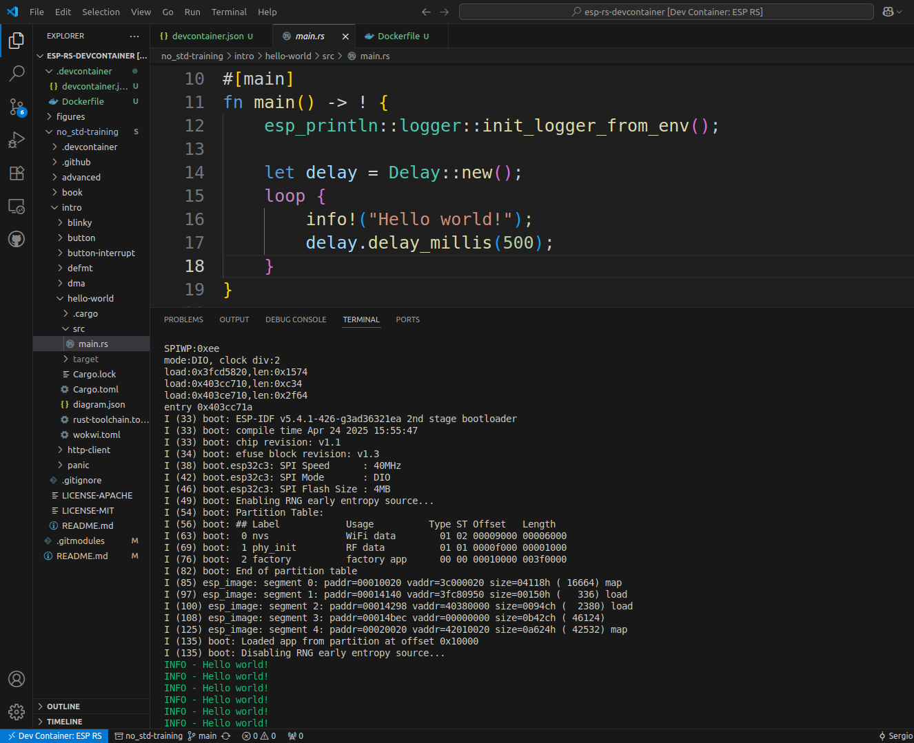

# esp-rs-devcontainer
DevContainer for Rust on Espressif microcontrollers 🤩 😃.

Tested on Linux (Ubuntu 22.04.5 LTS) using [espressif/idf-rust:esp32c3_latest](https://hub.docker.com/layers/espressif/idf-rust/esp32c3_latest/images/sha256-7ce30fba75dd940d5b2406f706c399bf2318fe701da79819bdaa7b39b30a152d) image for ```esp32c3``` devboard. 

Feel free to try out other dev board images found in [espressif/idf-rust](https://hub.docker.com/r/espressif/idf-rust/tags)

# Requirements
- [Docker](https://www.docker.com/)
- [Visual Studio Code](https://code.visualstudio.com/) 
- [Remote Development extension pack](https://marketplace.visualstudio.com/items?itemName=ms-vscode-remote.vscode-remote-extensionpack) in Visual Studio Code Marketplace.

# Set Up
1. Clone repository and open on VS Code
    ```sh
    git clone --recursive https://github.com/MasterpieceTechVideos/esp-rs-devcontainer.git

    code esp-rs-devcontainer
    ```
2. Reopen project in container

    https://github.com/user-attachments/assets/8d09056a-3790-4e9a-9226-dc3e4273d62a


3. Open new terminal in container and run the sample projects on your connected ```esp32c3``` dev board.
    ```sh
    cd /workspaces/esp-rs-devcontainer/no_std-training/intro/hello-world/

    cargo run
    ```


